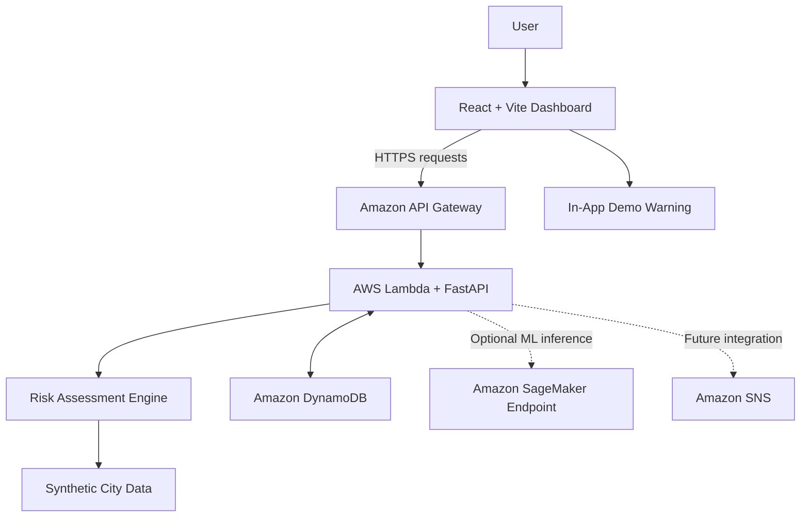

# DrainMind — Urban Waterlogging Risk & Response Simulator

**Predict urban waterlogging risk. Explore possible outcomes. Simulate smarter responses.**

DrainMind is a hackathon MVP that explores how urban waterlogging risk can be assessed, how soon flooding might occur under a modeled scenario, and how different response interventions could influence the outcome.

The platform provides an interactive dashboard for exploring neighborhood-level risk, examining the factors contributing to that risk, viewing a modeled forecast timeline, and comparing hypothetical mitigation strategies.

**Live application:** https://main.d2w9g6yrzlunpc.amplifyapp.com/

**Repository:** https://github.com/sharmasid100/flood-risk-dashboard

> **Project status:** Prototype / proof of concept.
> DrainMind currently uses a fictional city and deterministic synthetic demo data. Its predictions are produced by an explainable rule-based model and are not validated hydrological forecasts. Real-city data integration, operational alerts, and SMS notifications are planned future enhancements.

---

## Table of Contents

- [Overview](#-overview)
- [Problem Statement](#-problem-statement)
- [Key Features](#-key-features)
- [Live Demo](#-live-demo)
- [Technology Stack](#-technology-stack)
- [System Architecture](#-system-architecture)
- [Getting Started](#-getting-started)
- [Demo Workflow](#-demo-workflow)
- [Risk Modeling](#-risk-modeling)
- [API Reference](#-api-reference)
- [AWS Deployment](#-aws-deployment)
- [Testing](#-testing)
- [Current Limitations](#-current-limitations)
- [Future Scope](#-future-scope)
- [Contributing](#-contributing)
- [Disclaimer](#-disclaimer)
- [License](#-license)

## Overview

Urban waterlogging can disrupt transportation, damage infrastructure, affect homes and businesses, and create risks for public safety. Rainfall intensity, drainage capacity, elevation, land cover, and local vulnerability can all influence how water accumulates across a city.

DrainMind demonstrates a potential approach to exploring these factors through an interactive, neighborhood-oriented risk dashboard.

Users can adjust rainfall conditions, inspect modeled risk levels, explore potential time-to-flood estimates, and simulate response actions to compare possible outcomes.

The current demonstration uses **Verdantia**, a fictional city comprising 30 neighborhoods. All neighborhood attributes, populations, weather observations, and predictions are deterministic synthetic data designed for demonstrating the application's workflow.

DrainMind is designed as an extensible prototype that can evolve toward real-city deployment when reliable geospatial, meteorological, drainage, and historical flood-event data become available.

## Problem Statement

Urban authorities and emergency response teams need accessible ways to understand where waterlogging may occur, which locations could be more vulnerable, and what response options might be worth considering.

However, evaluating these scenarios can require combining information from multiple sources and understanding how environmental and infrastructure factors interact.

DrainMind explores a unified interface for:

- Visualizing relative waterlogging risk across neighborhoods.
- Understanding the factors contributing to modeled risk.
- Exploring hypothetical rainfall scenarios.
- Examining estimated flood timing and forecast trajectories.
- Comparing the modeled effects of possible mitigation actions.
- Presenting potential warnings through an interactive dashboard.

The objective of this MVP is to demonstrate the workflow and architecture of a potential decision-support system, not to provide operational flood warnings.

## Key Features

### 1. Interactive Neighborhood Risk Dashboard

- Displays 30 fictional neighborhoods in a schematic city layout.
- Visualizes relative risk using neighborhood-level indicators.
- Updates risk metrics when rainfall conditions change.
- Presents city-level summaries and estimated affected-population totals.

### 2. Dynamic Rainfall Simulation

Adjust the simulated rainfall intensity to explore different scenarios, including 25, 50, and 80 mm/hr.

The backend recalculates risk metrics using the selected scenario, allowing users to observe how the modeled outcomes change.

These values represent hypothetical scenarios rather than live weather measurements.

### 3. Explainable Risk Assessment

The current rule-based model considers:

- Rainfall intensity.
- Drainage capacity.
- Elevation.
- Impervious surface coverage.
- Historical vulnerability attributes.

The dashboard presents risk drivers to help users understand why a neighborhood receives a particular modeled risk score.

### 4. Flood Timing and Forecast Timeline

Explore a modeled 60-minute risk timeline and an estimated time-to-flood value for a selected neighborhood.

These estimates are heuristic outputs of the prototype, not scientifically validated predictions of when flooding will begin.

### 5. Intervention Simulation

Compare hypothetical responses and examine how they affect the model's outputs.

Supported intervention scenarios include:

- Improving effective drainage capacity.
- Increasing pumping capacity.
- Reducing impervious runoff.
- Introducing open storage to reduce effective rainfall reaching drains.
- Issuing an emergency warning to model a separate illustrative exposure reduction.

The warning scenario does not physically reduce flood severity. It models a hypothetical reduction in exposure separately.

### 6. In-App Warning Demonstration

The dashboard includes an **Issue Warning** interaction to demonstrate how a warning workflow might appear to a user.

Currently, this produces an in-app demonstration notice only. **SMS delivery and real-world notifications are disabled.**

### 7. Cloud-Ready Backend

The project includes deployment configuration for:

- AWS Lambda for backend execution.
- Amazon API Gateway for HTTP API access.
- Amazon DynamoDB for per-session rainfall scenario state.
- Amazon SNS as a foundation for a possible future notification workflow.
- AWS Amplify for frontend hosting.

The inclusion of a service in the architecture does not imply that every integration is active or operationally configured.

## Live Demo

Access the deployed dashboard:

**https://main.d2w9g6yrzlunpc.amplifyapp.com/**

Suggested demonstration:

1. Open the dashboard and explore the fictional city.
2. Change rainfall intensity and observe how neighborhood risk indicators update.
3. Select a neighborhood to inspect risk drivers, flood timing, and forecast information.
4. Explore the available recommendations.
5. Simulate a response intervention and compare the modeled outcomes.
6. Use the in-app warning interaction to see the prototype notification workflow.

The application is a demonstration environment. Its results should not be used to make real-world emergency, evacuation, or infrastructure decisions.

## 🛠️ Technology Stack

| Component | Technology | Purpose |
|---|---|---|
| Frontend | React, Vite | Interactive dashboard |
| Backend | Python, FastAPI | REST API and application logic |
| Risk engine | Python | Explainable, rule-based risk calculations |
| API hosting | AWS Lambda | Serverless backend execution |
| API routing | Amazon API Gateway | Exposes backend endpoints |
| Scenario state | Amazon DynamoDB | Stores per-session rainfall state |
| Notification foundation | Amazon SNS | Potential future notification integration |
| Frontend hosting | AWS Amplify | Hosts the web dashboard |
| Optional ML inference | Amazon SageMaker Runtime | Adapter for a separately deployed ML endpoint |
| Containerization | Docker, Docker Compose | Local container-based development |

## System Architecture

The prototype separates the dashboard, backend API, risk calculation engine, and cloud infrastructure.



### Request Flow

1. The user changes a rainfall scenario or selects a neighborhood.
2. The frontend sends an HTTP request to the FastAPI backend through API Gateway.
3. The backend evaluates the requested scenario using the active risk predictor.
4. Scenario state is maintained per browser session, with revision tracking to prevent older delayed updates from overwriting newer ones.
5. The backend returns JSON containing the relevant modeled risk information.
6. The frontend updates the dashboard and its visualizations.

The active predictor is rule-based by default. The optional SageMaker adapter requires a separately deployed, compatible model endpoint and is not a claim that a trained model is currently operating in production.

## Getting Started

### Prerequisites

Install the following tools:

- Node.js 20 or later.
- Python 3.12 or later.
- npm.
- Git.

For Docker-based development, install Docker Desktop with Docker Compose support.

### 1. Clone the Repository

```powershell
git clone https://github.com/sharmasid100/flood-risk-dashboard.git
cd flood-risk-dashboard
```

### 2. Start the Backend

Open a terminal at the repository root:

```powershell
cd backend

python -m venv .venv
.\.venv\Scripts\Activate.ps1

pip install -r requirements.txt

uvicorn app.main:app --reload --port 8000
```

The backend should now be available locally.

- Health check: http://localhost:8000/health
- Interactive API documentation: http://localhost:8000/docs
- OpenAPI schema: http://localhost:8000/openapi.json

If PowerShell blocks virtual environment activation, review your local execution policy or use another supported activation method. Avoid changing system-wide security settings unnecessarily.

### 3. Start the Frontend

Open a second terminal from the repository root:

```powershell
cd frontend

npm install
npm run dev
```

Open:

http://localhost:5173

Ensure the frontend's API base URL points to the local backend when running the application locally. The hosted Amplify environment uses its separately configured `VITE_API_URL`.

### 4. Run with Docker Compose

Alternatively, from the repository root:

```powershell
docker compose up --build
```

Use the service URLs and port mappings defined in the project's Compose configuration.

## Demo Workflow

### Scenario A: Rainfall Changes

Adjust the rainfall slider and compare the resulting risk distribution.

For example, explore hypothetical rainfall intensities of 25, 50, and 80 mm/hr.

### Scenario B: Neighborhood Investigation

Select a neighborhood and inspect:

- Its modeled risk score and category.
- Contributing risk factors.
- Estimated time-to-flood.
- Forecast timeline.
- Ranked intervention recommendations.

### Scenario C: Response Comparison

Choose an available intervention and compare the baseline and intervention scenarios.

The resulting comparison represents the assumptions encoded in the simulation, not a guarantee that the same action would achieve an equivalent real-world outcome.

### Scenario D: Warning Workflow

Trigger the in-app warning demonstration to explore the interface for communicating a potential risk.

No SMS or external emergency notification is sent.

## Risk Modeling

### Current Model

The active implementation uses an explainable weighted scoring approach.

Initial configurable weights in `backend/app/engine.py`:

| Factor | Weight |
|---|---:|
| Rainfall | 0.35 |
| Drainage | 0.25 |
| Elevation | 0.15 |
| Impervious surface | 0.15 |
| Historical vulnerability | 0.10 |
| **Total** | **1.00** |

The components are normalized to a 0–1 scale and combined into a weighted score, which is represented on a 0–100 risk scale.

The configured risk categories are:

| Score | Category |
|---|---|
| 0–25 | LOW |
| 26–50 | MODERATE |
| 51–75 | HIGH |
| 76–100 | CRITICAL |

The implementation also derives a heuristic time-to-flood estimate from rainfall, drainage capacity, and vulnerability-related factors. Severity is derived from the modeled score.

These weights, thresholds, and estimates are configurable prototype assumptions. They have not been established through hydrological calibration or validation against real flood events.

### Optional Machine Learning Extension

The backend includes a `FloodPredictor` interface and an optional `MLFloodPredictor` adapter for Amazon SageMaker Runtime.

A compatible deployed endpoint is expected to accept a payload shaped like:

```json
{
  "features": {
    "example_feature": 1.0
  }
}
```

The endpoint should return at least:

```json
{
  "risk_score": 65.0,
  "time_to_flood_minutes": 30
}
```

Optional response fields include `severity` and `factors`.

Setting `SAGEMAKER_ENDPOINT_NAME` enables the configured ML integration path, subject to the project's implementation and AWS permissions. A compatible model must first be trained, evaluated, deployed, and tested.

**Important:** The synthetic Verdantia data is intended for demonstration, not model training or scientific validation. Realistic ML forecasting will require validated historical rainfall, drainage, geospatial, and flood-event records.

## API Reference

All listed endpoints return JSON.

| Method | Endpoint | Description |
|---|---|---|
| GET | `/api/areas` | Retrieve fictional neighborhood attributes |
| GET | `/api/weather` | Retrieve the synthetic weather observation |
| GET | `/api/risk` | Calculate risk for all neighborhoods |
| GET | `/api/risk/{area_id}` | Retrieve risk and contributing factors for one neighborhood |
| GET | `/api/forecast/{area_id}` | Retrieve a modeled 60-minute risk timeline |
| POST | `/api/simulate/rainfall` | Update scenario rainfall and recalculate risk |
| POST | `/api/intervention/simulate` | Compare a baseline with a hypothetical intervention |
| GET | `/api/recommendations/{area_id}` | Retrieve ranked recommendations and explanations |
| GET | `/api/dashboard/summary` | Retrieve city-level risk and affected-population totals |

The exact request and response schemas are available from the running API's OpenAPI documentation at `/docs`.

### Scenario Headers

The API uses two custom headers for scenario management:

- `X-Simulation-Id`: Identifies the browser session's simulation.
- `X-Simulation-Revision`: Tracks scenario revisions so that older, delayed requests cannot overwrite newer updates.

These headers support consistent interactive behavior within the prototype. They do not replace production-grade authentication, authorization, or distributed concurrency controls.

## AWS Deployment

The repository includes an AWS SAM template for preparing the backend deployment.

### Prerequisites

Install and configure:

- AWS CLI.
- AWS SAM CLI.
- Appropriate AWS IAM permissions.
- An AWS account and target deployment region.

Do not commit AWS access keys, secret keys, or other credentials to the repository.

### Build and Deploy

From the repository root:

```powershell
sam build --template-file backend/template.yaml
sam deploy --guided --template-file .aws-sam/build/template.yaml
```

Review the deployment configuration and change set carefully before confirming.

After deployment:

1. Retrieve the `ApiUrl` output from the CloudFormation stack.
2. Set the frontend environment variable `VITE_API_URL` in AWS Amplify to the deployed API base URL, including the appropriate stage path.
3. Set Lambda's `CORS_ORIGINS` configuration to include the exact deployed frontend origin:

   `https://main.d2w9g6yrzlunpc.amplifyapp.com`

4. Ensure API Gateway is configured to handle CORS preflight `OPTIONS` requests and that the allowed methods and headers match the frontend.
5. Redeploy or update the relevant cloud resources and rebuild the frontend when necessary.
6. Test the actual `/api/risk` endpoint from the hosted dashboard.

CORS must be configured consistently between the frontend origin, the API Gateway configuration, and the backend middleware. If preflight requests fail, inspect the HTTP response and API Gateway/Lambda logs rather than assuming the frontend code is responsible.

### Amplify Frontend

Connect the GitHub repository to AWS Amplify, configure the app root as `frontend`, and use `frontend/amplify.yml` for the frontend build.

Set `VITE_API_URL` to the actual deployed API URL. Vite environment variables are incorporated into the frontend build, so changing this value requires a new build and deployment.

### Notification Configuration

The current configuration uses:

`ALERT_MODE=local_demo`

This keeps the warning interaction in demonstration mode. An SNS topic in the infrastructure template does not mean SMS delivery is active.

SMS integration should only be enabled after the notification workflow, AWS permissions, recipient management, consent, regional requirements, and delivery-failure handling have been implemented and tested.

## Testing

### Backend Tests

From the repository root:

```powershell
cd backend

pip install -r requirements-dev.txt

python -m unittest discover -s tests -v
```

### Frontend Production Build

From the repository root:

```powershell
cd frontend

npm run build
```

### Manual Integration Checks

After deploying changes, verify:

- The API health endpoint responds successfully.
- `/docs` loads when public access is intended.
- `GET /api/risk` returns the expected JSON structure.
- The browser's preflight `OPTIONS` request succeeds.
- The frontend uses the correct API URL.
- Rainfall updates do not allow older requests to replace newer scenarios.
- Intervention simulations return consistent baseline and comparison data.
- The warning action remains in-app only unless a separately tested notification integration has been enabled.

## Current Limitations

DrainMind is an early-stage prototype. The following limitations are important:

1. **Fictional geography:** Verdantia is not a real city, and its 30 neighborhoods use synthetic attributes and schematic geometry.
2. **Synthetic environmental data:** Rainfall, populations, drainage attributes, and related inputs are generated for demonstration.
3. **No live sensors:** The application does not currently ingest live rainfall gauges, water-level sensors, or IoT feeds.
4. **Unvalidated predictions:** Risk scores, flood timing, and severity are modeled outputs, not calibrated or validated hydrological forecasts.
5. **Rule-based default:** The active risk engine uses configurable heuristic weights and thresholds.
6. **No operational alerts:** The warning interaction displays an in-app demonstration notice. SMS delivery is currently disabled.
7. **Illustrative interventions:** Simulated response effects are assumptions encoded in the prototype, not guaranteed real-world benefits.
8. **Production readiness:** Real-world deployment would require validation, monitoring, access controls, reliability engineering, and appropriate operational oversight.

## 🔭 Future Scope

DrainMind is intended to serve as a foundation for a more comprehensive urban waterlogging decision-support platform. The following enhancements represent potential future development; they are not claims of current functionality.

### Phase 1 — Real-City Data Integration

Replace fictional neighborhood records with data from a selected real city.

Potential additions include:

- Actual administrative boundaries and neighborhood identifiers.
- Digital elevation models and terrain-derived drainage characteristics.
- Land-use and impervious-surface datasets.
- Drainage network maps, culvert attributes, and pumping infrastructure records.
- Historical rainfall and documented waterlogging or flood events.
- Population and infrastructure exposure datasets.

Data sources, licensing, spatial resolution, and update frequency would need to be assessed for each deployment location.

### Phase 2 — Live Weather and Sensor Integration

Introduce reliable environmental data feeds to update risk assessments as conditions change.

Potential integrations include:

- Weather observation and forecast APIs.
- Rain gauges and automated weather stations.
- Water-level sensors in drains, canals, and low-lying areas.
- IoT gateways and telemetry ingestion pipelines.
- Data-quality checks, missing-value handling, and sensor-health monitoring.

This phase would move the platform from manually configured scenarios toward data-informed risk assessment.

### Phase 3 — Machine Learning and Forecasting

Develop and evaluate models using validated historical records and relevant real-time features.

Potential approaches include:

- Random Forest and gradient-boosting baselines.
- Time-series forecasting models.
- Temporal Convolutional Networks (TCNs) or LSTMs where the available data supports their use.
- Spatial models that account for interactions between connected neighborhoods and drainage systems.
- Model calibration, uncertainty estimates, and comparisons against simple baseline methods.

Model performance should be evaluated on temporally held-out events and, where possible, independently observed flood incidents.

Candidate metrics include MAE, RMSE, WAPE, event-detection precision and recall, and lead-time performance. Suitable acceptance thresholds must be established from the intended operational use case and real validation data.

### Phase 4 — SMS and Multi-Channel Alerts

Enable an actual notification pipeline after the alert workflow is designed and tested.

Potential features include:

- SMS notifications through Amazon SNS or another appropriate messaging provider.
- Location-specific warning subscriptions.
- User consent and recipient verification.
- Configurable alert thresholds and severity levels.
- Duplicate suppression, rate limits, and escalation rules.
- Delivery-status tracking and failure handling.
- In-app notifications, email, and other communication channels.
- Administrative controls for testing, approving, and cancelling alerts.

SMS is currently disabled. Future activation will require suitable AWS configuration, recipient subscription management, compliance with applicable rules, and end-to-end testing.

Any operational alerting system should communicate uncertainty and avoid presenting unvalidated model outputs as authoritative emergency warnings.

### Phase 5 — Improved Geospatial Visualization

Replace the fictional schematic grid with real geospatial visualization.

Potential improvements include:

- Map overlays using real neighborhood boundaries.
- Rainfall and flood-risk heatmaps.
- Elevation and drainage-network layers.
- Waterlogging hotspots and affected infrastructure.
- Time-based map animations.
- Optional integration with an appropriate mapping or GIS provider.

Map provider selection, licensing, data availability, and map-token requirements would be evaluated during implementation.

### Phase 6 — Decision Support and Resource Optimization

Extend intervention simulations into a more comprehensive decision-support workflow.

Potential capabilities include:

- Drainage maintenance prioritization.
- Pump and response-team placement.
- Resource allocation under capacity constraints.
- Alternative mitigation scenario comparison.
- Infrastructure investment planning.
- Estimated exposure and service-disruption analysis.
- Optimization of response timing and resource deployment.

Such capabilities would require realistic infrastructure data, explicit constraints, and validation with domain experts before operational use.

### Phase 7 — Production-Ready Platform

Prepare the system for controlled real-world pilots through:

- Authentication and role-based access control.
- Audit trails and scenario history.
- API rate limiting and input validation.
- Secure secret management.
- Centralized logs, metrics, and distributed tracing.
- Model and data-drift monitoring.
- Automated testing and CI/CD.
- Versioned model deployment and rollback.
- Disaster recovery and availability planning.
- Privacy, accessibility, and security reviews.

A controlled pilot should precede any deployment that informs public safety decisions.

## Contributing

Contributions, feedback, and ideas are welcome.

A suggested workflow:

1. Fork the repository.
2. Create a feature branch.
3. Implement and test your changes.
4. Document new endpoints, configuration, and assumptions.
5. Submit a pull request describing the change.

For substantial changes, particularly model replacements, real-data integrations, and alerting, include the relevant validation approach and known limitations.

##  Disclaimer

DrainMind is a hackathon prototype for educational, experimental, and demonstration purposes.

It does not currently provide validated flood forecasts, official weather warnings, or certified emergency-response recommendations. All outputs from the fictional Verdantia demonstration are synthetic or heuristic.

Do not use the prototype to make real-world evacuation, emergency response, infrastructure, or public-safety decisions.

Any future deployment for a real city should be supported by reliable data, independent validation, uncertainty assessment, domain-expert review, and appropriate operational safeguards.

## License

No license is specified in this README. Before reusing, modifying, or distributing the project, check the repository for an existing license or add an appropriate license file.
